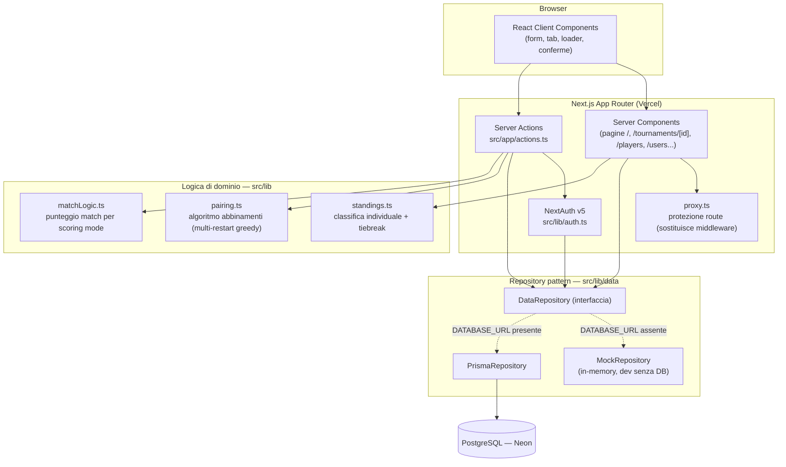
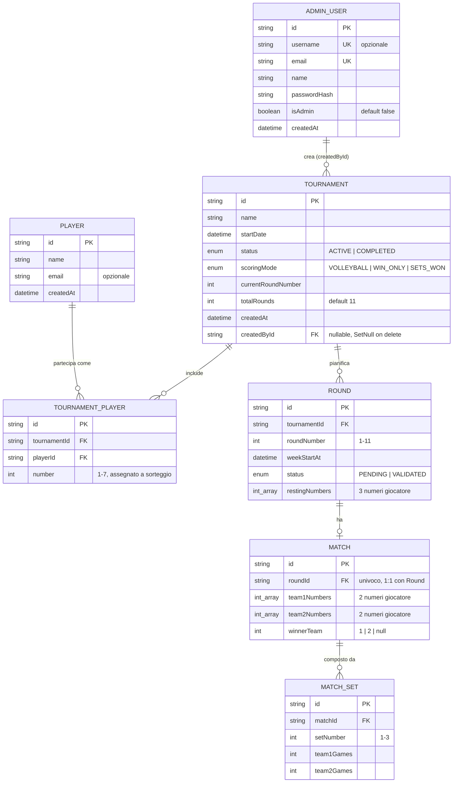

# Architettura dell'applicazione — Torneo Padel

Documento di riferimento per l'architettura tecnica dell'app e per il modello dati
(con diagramma ER). Aggiornato al refactor "calendario completo alla creazione" +
sezione gestione utenti.

## 1. Panoramica

Gestionale per un torneo di padel a 7 giocatori a rotazione (11 turni, una partita a
turno al meglio di 3 set, 3 giocatori a riposo). L'app calcola automaticamente gli
abbinamenti di ogni turno, gestisce la classifica individuale con 3 modalità di
punteggio configurabili, e offre un'area di amministrazione per giocatori, tornei e
utenti.

## 2. Stack tecnologico

| Livello | Tecnologia |
|---|---|
| Framework | Next.js 16 (App Router, Server Components + Server Actions) |
| Linguaggio | TypeScript |
| UI | React 19, Tailwind CSS v4 |
| Autenticazione | NextAuth v5 (beta), provider Credentials, sessioni JWT |
| ORM | Prisma 6 |
| Database | PostgreSQL (Neon, via integrazione marketplace Vercel) |
| Hosting | Vercel (deploy via CLI / Git) |
| Validazione input | Zod |
| Hash password | bcryptjs |

## 3. Architettura a livelli



Il **repository pattern** (`src/lib/data/repository.ts`) è il cuore del disaccoppiamento:
pagine e server actions dipendono solo dall'interfaccia `DataRepository`, mai
direttamente da Prisma o dai dati mock. La factory (`src/lib/data/index.ts`) sceglie
l'implementazione a runtime in base alla presenza di `DATABASE_URL` (o della variabile
esplicita `DATA_SOURCE=mock|prisma`), permettendo di sviluppare in locale senza alcun
database reale.

## 4. Struttura delle cartelle principali

```
src/
├── app/
│   ├── page.tsx                 # lista tornei (home)
│   ├── actions.ts                # tutte le server action
│   ├── login/                    # pagina di accesso
│   ├── players/                  # gestione anagrafica giocatori
│   ├── users/                    # gestione utenti (solo admin)
│   ├── tournaments/
│   │   ├── new/                  # creazione torneo (form + loader)
│   │   └── [id]/                 # dettaglio torneo (tab: Partite/Classifica/...)
│   ├── round/[id]/               # redirect di cortesia verso il torneo
│   └── api/auth/[...nextauth]/   # route handler NextAuth
├── components/                   # Header, TournamentTabs, RoundMatchCard, ecc.
├── lib/
│   ├── auth.ts                   # configurazione NextAuth
│   ├── prisma.ts                 # singleton PrismaClient
│   ├── pairing.ts                # algoritmo di abbinamento
│   ├── standings.ts               # calcolo classifica
│   ├── matchLogic.ts              # punteggio match / vincitore
│   ├── stats.ts                   # matrici compagni/avversari
│   ├── types.ts                   # tipi di dominio condivisi (mock + prisma)
│   └── data/
│       ├── repository.ts          # interfaccia DataRepository
│       ├── index.ts               # factory mock/prisma
│       ├── mock/                  # implementazione in-memory
│       └── prisma/                # implementazione Postgres reale
├── proxy.ts                       # protezione route (ex middleware.ts)
└── types/next-auth.d.ts           # augmentation tipi sessione/JWT (role)
prisma/
├── schema.prisma
├── migrations/
└── seed.ts
```

## 5. Autenticazione e autorizzazione

- **Provider**: Credentials (email + password), hash con bcrypt, sessione JWT.
- **Ruoli**: `AdminUser.isAdmin` (boolean) determina `session.user.role` = `"ADMIN" | "USER"`.
- **Protezione route**: `proxy.ts` reindirizza a `/login` ogni richiesta non autenticata
  (eccetto `/login` e `/api/auth/*`).
- **Autorizzazioni granulari** (controllate sia in UI sia server-side, mai solo
  nascondendo un bottone):
  - Creazione torneo, creazione utenti → solo `role === "ADMIN"`.
  - Eliminazione torneo → solo l'admin che l'ha creato (`tournament.createdById === session.user.id`).
  - Inserimento/convalida risultato di un turno → solo se è il turno attivo
    (`round.roundNumber === tournament.currentRoundNumber`).

## 6. Modello dati — Diagramma ER



Note sul modello:
- `TournamentPlayer` è la tabella ponte tra `Player` (anagrafica globale, riusabile tra
  tornei) e `Tournament`, e porta il `number` (1-7) assegnato a sorteggio: è la chiave
  di dominio usata ovunque (algoritmo di pairing, classifica, UI) al posto degli id.
- `Round` e `Match` sono in relazione 1:1: ogni turno ha al più una partita.
- Cascade delete: eliminando un `Tournament` vengono eliminati a cascata
  `TournamentPlayer`, `Round`, `Match`, `MatchSet`. Eliminando un `AdminUser` i suoi
  tornei non vengono eliminati (`createdById` passa a `null`, `onDelete: SetNull`).
- Vincoli di unicità: `(tournamentId, roundNumber)`, `(tournamentId, number)`,
  `(tournamentId, playerId)`, `(matchId, setNumber)`.

## 7. Logica di dominio chiave

### 7.1 Algoritmo di abbinamento (`src/lib/pairing.ts`)
- Calcolato **interamente alla creazione del torneo** (`generateFullSchedule`): tutti
  gli 11 turni sono visibili da subito con i rispettivi accoppiamenti.
- Per ogni turno valuta tutte le combinazioni possibili (chi riposa + come si
  accoppiano i 4 in campo) e sceglie quella che minimizza un costo quadratico basato
  su: ripetizioni di compagni, ripetizioni di avversari, sbilanciamento dei riposi.
- Esegue 400 simulazioni randomizzate dell'intero calendario rimanente per ogni turno
  pianificato e tiene la migliore (euristica multi-restart), per evitare minimi locali
  del greedy puro.
- Verificabile con `npm run simulate` (`scripts/simulate-schedule.ts`).

### 7.2 Regola di attivazione dei turni
Anche se tutti gli abbinamenti sono noti da subito, un turno è **giocabile/convalidabile
solo se è il turno corrente** del torneo (`currentRoundNumber`). I turni futuri sono
mostrati ma con input disabilitati ("in attesa"); la convalida di un turno fa avanzare
`currentRoundNumber` sbloccando il successivo. Vincolo applicato sia in UI
(`RoundMatchCard`) sia server-side (`submitMatchResult`/`validateRound`).

### 7.3 Punteggio e classifica (`matchLogic.ts`, `standings.ts`)
Tre modalità di punteggio selezionabili alla creazione del torneo:

| Modalità | Vittoria 2-0 | Vittoria 2-1 |
|---|---|---|
| `VOLLEYBALL` | 3 / 0 | 2 / 1 |
| `WIN_ONLY` | 1 / 0 | 1 / 0 |
| `SETS_WON` | 2 / 0 | 2 / 1 |

Classifica individuale: ogni giocatore eredita i punti della squadra con cui ha
giocato quel turno. Parità risolta in cascata con: differenza set → differenza game →
scontro diretto (aggregato su tutti gli incontri tra i due giocatori).

### 7.4 Log delle operazioni (`AuditLog`, `src/lib/audit.ts`)
Ogni operazione CRUD eseguita dalle server action viene registrata nella tabella
`AuditLog` tramite `logAudit()` (che passa da `DataRepository.createAuditLog`):
data (`createdAt`), utente (`userId`, `username` denormalizzato), tipo operazione
(`CREATE | UPDATE | DELETE`), `entityType`, `entityId` e `details` (JSON). Nessuna FK
verso `AdminUser`, cosi' i log sopravvivono all'eliminazione dell'utente. Un errore
di scrittura del log non fa fallire l'operazione. Nel repository mock i log restano
in memoria. Non e' replicato su Dataverse.

## 8. Deploy

- **Hosting**: Vercel, progetto `brokenedos-projects/padel-torneo`.
- **Database**: Neon Postgres, provisionato tramite integrazione marketplace nativa
  (`vercel integration add neon`), stesso branch condiviso tra Production/Preview/Development.
- **Variabili d'ambiente**: `AUTH_SECRET` (NextAuth), `DATABASE_URL` (Neon). Il comando
  `postinstall` esegue `prisma generate` ad ogni build.
- **Migrazioni**: `prisma/migrations/` versionate nel repository, applicate con
  `npx prisma migrate dev` (locale) / `prisma migrate deploy` (produzione).
